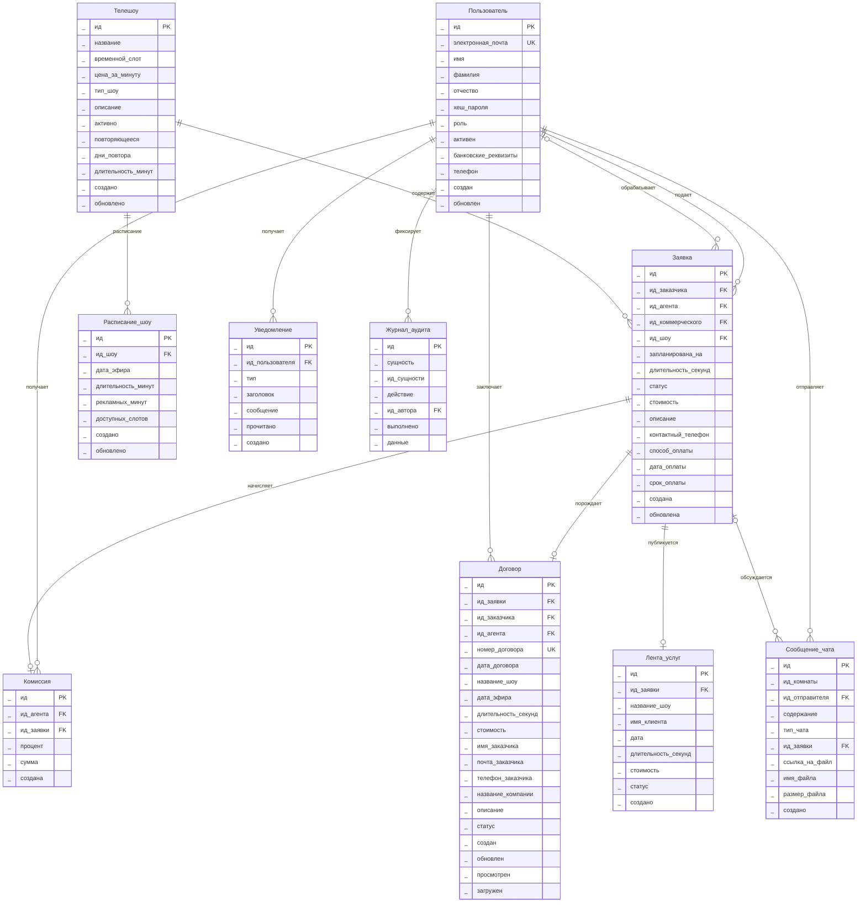

# Лабораторная работа №10 — Проектирование БД

## Цель работы
Освоение технологии проектирования баз данных. Создание концептуальной, логической и физической моделей реляционной БД для системы управления рекламными размещениями на ТВ (TVCompanyX).

---

## Предметная область

Система TVCompanyX автоматизирует процесс размещения рекламы на телевидении. Основные сущности предметной области:

- **Пользователь** — участник системы с одной из ролей (заказчик, агент, коммерческий отдел, бухгалтер, администратор, директор)
- **Телешоу** — передача, в эфире которой размещается реклама
- **Расписание шоу** — конкретная дата эфира, количество рекламных минут и слотов
- **Заявка** — запрос заказчика на размещение рекламы в конкретном шоу
- **Комиссия** — вознаграждение агенту за обработку заявки
- **Договор** — юридический документ, формируемый после одобрения заявки
- **Сообщение чата** — переписка между участниками по заявке
- **Уведомление** — системное оповещение пользователя
- **Лента услуг** — публичный реестр выполненных/запланированных размещений
- **Журнал аудита** — запись всех действий в системе

---

## 1. Концептуальная модель (нотация Чена)

> **Нотация Чена (Peter Chen, 1976):**
> - **Прямоугольники** — сущности (таблицы)
> - **Ромбы** — связи между сущностями
> - **Овалы** — атрибуты сущностей
> - **Подчёркнутые атрибуты** — первичные ключи (PK)
> - Числа на линиях — мощность связи (1, N, 0..1)

```mermaid
graph TB
    %% ===================== СТИЛИ НОТАЦИИ ЧЕНА =====================
    classDef entity fill:#f5f5f5,stroke:#000,stroke-width:2px,font-weight:bold
    classDef rel fill:#f5f5f5,stroke:#000,stroke-width:1px
    classDef attr fill:#ffffff,stroke:#000,stroke-width:1px

    %% ===================== СУЩНОСТИ (прямоугольники) =====================
    USERS["ПОЛЬЗОВАТЕЛЬ"]:::entity
    SHOWS["ТЕЛЕШОУ"]:::entity
    SCHED["РАСПИСАНИЕ ШОУ"]:::entity
    APPS["ЗАЯВКА"]:::entity
    COMMS["КОМИССИЯ"]:::entity
    CONTR["ДОГОВОР"]:::entity
    CHAT["СООБЩЕНИЕ ЧАТА"]:::entity
    NOTIF["УВЕДОМЛЕНИЕ"]:::entity
    FEED["ЛЕНТА УСЛУГ"]:::entity
    AUDIT["ЖУРНАЛ АУДИТА"]:::entity

    %% ===================== СВЯЗИ (ромбы) =====================
    R1{"подает\n(заказчик)"}:::rel
    R2{"обрабатывает\n(агент)"}:::rel
    R3{"размещается в"}:::rel
    R4{"имеет\nрасписание"}:::rel
    R5{"получает\nкомиссию"}:::rel
    R6{"начисляет"}:::rel
    R7{"порождает"}:::rel
    R8{"отправляет\nсообщение"}:::rel
    R9{"обсуждается"}:::rel
    R10{"получает\nуведомление"}:::rel
    R11{"публикуется"}:::rel
    R12{"фиксирует\nдействие"}:::rel

    %% ===================== АТРИБУТЫ: ПОЛЬЗОВАТЕЛЬ (овалы) =====================
    u_email(["email"]):::attr
    u_role(["роль"]):::attr
    u_name(["ФИО"]):::attr
    u_phone(["телефон"]):::attr
    u_active(["активен"]):::attr

    u_email --- USERS
    u_role --- USERS
    u_name --- USERS
    u_phone --- USERS
    u_active --- USERS

    %% ===================== АТРИБУТЫ: ЗАЯВКА =====================
    a_status(["статус"]):::attr
    a_cost(["стоимость"]):::attr
    a_dur(["длительность"]):::attr
    a_desc(["описание"]):::attr
    a_pay(["способ оплаты"]):::attr

    a_status --- APPS
    a_cost --- APPS
    a_dur --- APPS
    a_desc --- APPS
    a_pay --- APPS

    %% ===================== АТРИБУТЫ: ТЕЛЕШОУ =====================
    s_name(["название"]):::attr
    s_slot(["временной слот"]):::attr
    s_price(["цена за мин"]):::attr
    s_type(["тип шоу"]):::attr

    s_name --- SHOWS
    s_slot --- SHOWS
    s_price --- SHOWS
    s_type --- SHOWS

    %% ===================== АТРИБУТЫ: РАСПИСАНИЕ ШОУ =====================
    sc_date(["дата эфира"]):::attr
    sc_dur(["длительность"]):::attr
    sc_ad(["рекл. минут"]):::attr
    sc_slots(["доступ. слотов"]):::attr

    sc_date --- SCHED
    sc_dur --- SCHED
    sc_ad --- SCHED
    sc_slots --- SCHED

    %% ===================== АТРИБУТЫ: КОМИССИЯ =====================
    c_pct(["процент"]):::attr
    c_amt(["сумма"]):::attr

    c_pct --- COMMS
    c_amt --- COMMS

    %% ===================== АТРИБУТЫ: ДОГОВОР =====================
    ct_num(["номер договора"]):::attr
    ct_date(["дата"]):::attr
    ct_cost(["стоимость"]):::attr
    ct_status(["статус"]):::attr

    ct_num --- CONTR
    ct_date --- CONTR
    ct_cost --- CONTR
    ct_status --- CONTR

    %% ===================== АТРИБУТЫ: СООБЩЕНИЕ ЧАТА =====================
    ch_room(["ид комнаты"]):::attr
    ch_content(["содержание"]):::attr
    ch_type(["тип чата"]):::attr

    ch_room --- CHAT
    ch_content --- CHAT
    ch_type --- CHAT

    %% ===================== АТРИБУТЫ: УВЕДОМЛЕНИЕ =====================
    n_type(["тип"]):::attr
    n_title(["заголовок"]):::attr
    n_msg(["сообщение"]):::attr
    n_read(["прочитано"]):::attr

    n_type --- NOTIF
    n_title --- NOTIF
    n_msg --- NOTIF
    n_read --- NOTIF

    %% ===================== АТРИБУТЫ: ЛЕНТА УСЛУГ =====================
    f_show(["название шоу"]):::attr
    f_client(["имя клиента"]):::attr
    f_cost(["стоимость"]):::attr
    f_status(["статус"]):::attr

    f_show --- FEED
    f_client --- FEED
    f_cost --- FEED
    f_status --- FEED

    %% ===================== АТРИБУТЫ: ЖУРНАЛ АУДИТА =====================
    au_entity(["сущность"]):::attr
    au_action(["действие"]):::attr
    au_data(["данные"]):::attr

    au_entity --- AUDIT
    au_action --- AUDIT
    au_data --- AUDIT

    %% ===================== СВЯЗИ МЕЖДУ СУЩНОСТЯМИ =====================
    USERS ---|"1"| R1 ---|"N"| APPS
    USERS ---|"1"| R2 ---|"N"| APPS
    APPS ---|"N"| R3 ---|"1"| SHOWS
    SHOWS ---|"1"| R4 ---|"N"| SCHED
    USERS ---|"1"| R5 ---|"N"| COMMS
    APPS ---|"1"| R6 ---|"0..1"| COMMS
    APPS ---|"1"| R7 ---|"0..1"| CONTR
    USERS ---|"1"| R8 ---|"N"| CHAT
    APPS ---|"1"| R9 ---|"N"| CHAT
    USERS ---|"1"| R10 ---|"N"| NOTIF
    APPS ---|"1"| R11 ---|"0..1"| FEED
    USERS ---|"1"| R12 ---|"N"| AUDIT
```



### Описание элементов нотации Чена

#### Сущности (10 таблиц БД)

| # | Сущность | Таблица БД | Ключевые атрибуты |
|---|----------|-----------|-------------------|
| 1 | ПОЛЬЗОВАТЕЛЬ | `users` | **ид** (PK), email, роль, ФИО, телефон, активен |
| 2 | ЗАЯВКА | `applications` | **ид** (PK), статус, стоимость, длительность, описание, способ оплаты |
| 3 | ТЕЛЕШОУ | `shows` | **ид** (PK), название, временной слот, цена за мин, тип шоу |
| 4 | РАСПИСАНИЕ ШОУ | `show_schedule` | **ид** (PK), дата эфира, длительность, рекл. минут, доступ. слотов |
| 5 | КОМИССИЯ | `commissions` | **ид** (PK), процент, сумма |
| 6 | ДОГОВОР | `contracts` | **ид** (PK), номер договора, дата, стоимость, статус |
| 7 | СООБЩЕНИЕ ЧАТА | `chat_messages` | **ид** (PK), ид комнаты, содержание, тип чата |
| 8 | УВЕДОМЛЕНИЕ | `notifications` | **ид** (PK), тип, заголовок, сообщение, прочитано |
| 9 | ЛЕНТА УСЛУГ | `services_feed` | **ид** (PK), название шоу, имя клиента, стоимость, статус |
| 10 | ЖУРНАЛ АУДИТА | `audit_log` | **ид** (PK), сущность, действие, данные |

#### Связи (12 отношений)

| # | Связь | Сущность 1 | Сущность 2 | Мощность | Описание |
|---|-------|-----------|-----------|----------|----------|
| 1 | подает (заказчик) | Пользователь | Заявка | 1 : N | Один заказчик подает много заявок |
| 2 | обрабатывает (агент) | Пользователь | Заявка | 1 : N | Один агент обрабатывает много заявок |
| 3 | размещается в | Заявка | Телешоу | N : 1 | Много заявок на одно шоу |
| 4 | имеет расписание | Телешоу | Расписание шоу | 1 : N | У шоу много дат в расписании |
| 5 | получает комиссию | Пользователь | Комиссия | 1 : N | Агент получает комиссии за заявки |
| 6 | начисляет | Заявка | Комиссия | 1 : 0..1 | По заявке начисляется одна комиссия |
| 7 | порождает | Заявка | Договор | 1 : 0..1 | По одной заявке максимум один договор |
| 8 | отправляет сообщение | Пользователь | Сообщение чата | 1 : N | Пользователь пишет много сообщений |
| 9 | обсуждается | Заявка | Сообщение чата | 1 : N | По заявке ведётся переписка |
| 10 | получает уведомление | Пользователь | Уведомление | 1 : N | Пользователь получает много уведомлений |
| 11 | публикуется | Заявка | Лента услуг | 1 : 0..1 | Одна заявка — одна запись в ленте |
| 12 | фиксирует действие | Пользователь | Журнал аудита | 1 : N | Действия пользователя логируются |

---

## 2. Логическая модель (нотация Мартина / Crow's Foot)

> Все названия на русском языке, типы данных опущены (указаны только имена атрибутов).
> Ключи PK / FK / UK отображаются справа от имени атрибута.
> Используется нотация «вороньи лапки» (Crow's Foot).
>
> **Файл draw.io:** [logical-model.drawio](logical-model.drawio) — открыть в draw.io / diagrams.net для визуализации.



---

## 3. Физическая модель (формат DBML для dbdiagram.io)

> Названия таблиц и столбцов на английском.
> Указаны реальные типы данных PostgreSQL.
> Код можно вставить на [dbdiagram.io](https://dbdiagram.io/) для визуализации.

```sql
// ============================================
// TVCompanyX — Physical Database Model (DBML)
// ============================================

Table users {
  id uuid [pk, default: `uuid_generate_v4()`]
  name varchar(255)
  first_name varchar(100)
  middle_name varchar(100)
  last_name varchar(100)
  email citext [unique, not null]
  password_hash varchar(255)
  role varchar(20) [not null, note: 'customer, agent, commercial, accountant, admin, director']
  is_active boolean [not null, default: true]
  bank_details jsonb
  phone varchar(20)
  created_at timestamptz [not null, default: `now()`]
  updated_at timestamptz [not null, default: `now()`]
}

Table shows {
  id uuid [pk, default: `uuid_generate_v4()`]
  name varchar(255) [not null]
  time_slot varchar(50) [not null]
  base_price_per_min numeric(12,2) [not null]
  show_type varchar(50) [default: 'program']
  description text
  is_active boolean [default: true]
  is_recurring boolean [default: false]
  recurring_days varchar(50) [default: 'daily']
  duration_minutes int [default: 60]
  created_at timestamptz [not null, default: `now()`]
  updated_at timestamptz [not null, default: `now()`]
}

Table show_schedule {
  id uuid [pk, default: `uuid_generate_v4()`]
  show_id uuid [not null]
  scheduled_date date [not null]
  duration_minutes int [not null]
  ad_minutes int [not null]
  available_slots int [not null]
  created_at timestamptz [not null, default: `now()`]
  updated_at timestamptz [not null, default: `now()`]

  indexes {
    (show_id, scheduled_date) [unique]
  }
}

Table applications {
  id uuid [pk, default: `uuid_generate_v4()`]
  customer_id uuid [not null]
  agent_id uuid
  commercial_id uuid
  show_id uuid [not null]
  scheduled_at timestamptz [not null]
  duration_seconds int [not null, note: 'CHECK 5..300']
  status varchar(20) [not null, default: 'pending', note: 'pending, in_progress, sent_to_commercial, approved, rejected, paid, overdue']
  cost numeric(14,2) [not null, default: 0]
  description text
  contact_phone varchar(20)
  payment_method varchar(20) [note: 'card, transfer, cash']
  payment_date timestamptz
  due_date timestamptz
  created_at timestamptz [not null, default: `now()`]
  updated_at timestamptz [not null, default: `now()`]
}

Table commissions {
  id uuid [pk, default: `uuid_generate_v4()`]
  agent_id uuid [not null]
  application_id uuid [not null]
  percent numeric(5,2) [not null]
  amount numeric(14,2) [not null, default: 0]
  created_at timestamptz [not null, default: `now()`]

  indexes {
    (agent_id, application_id) [unique]
  }
}

Table contracts {
  id uuid [pk, default: `uuid_generate_v4()`]
  application_id uuid [not null]
  customer_id uuid [not null]
  agent_id uuid [not null]
  contract_number varchar(50) [unique]
  contract_date timestamp [default: `now()`]
  show_name varchar(255)
  scheduled_at timestamp
  duration_seconds int
  cost decimal(10,2)
  customer_name varchar(255)
  customer_email varchar(255)
  customer_phone varchar(50)
  company_name varchar(255) [default: 'ТВ Компания X']
  description text
  status varchar(50) [default: 'sent', note: 'sent, viewed, downloaded']
  created_at timestamp [default: `now()`]
  updated_at timestamp [default: `now()`]
  viewed_at timestamp
  downloaded_at timestamp
}

Table chat_messages {
  id uuid [pk, default: `uuid_generate_v4()`]
  room_id varchar(100) [not null]
  sender_id uuid
  sender_name varchar(255)
  content text [not null]
  chat_type varchar(30) [default: 'customer-agent', note: 'customer-agent, agent-commercial']
  application_id uuid
  file_url varchar(512)
  file_name varchar(255)
  file_size bigint
  created_at timestamptz [not null, default: `now()`]
}

Table notifications {
  id uuid [pk, default: `uuid_generate_v4()`]
  user_id uuid [not null]
  type varchar(50) [not null]
  title varchar(255) [not null]
  message text [not null]
  read boolean [not null, default: false]
  created_at timestamptz [not null, default: `now()`]
}

Table services_feed {
  id uuid [pk, default: `uuid_generate_v4()`]
  application_id uuid [not null]
  show_name varchar(255) [not null]
  client_name varchar(255) [not null]
  date timestamptz [not null]
  duration_seconds int [not null]
  cost numeric(14,2) [not null]
  status varchar(20) [note: 'completed, scheduled']
  created_at timestamptz [not null, default: `now()`]
}

Table audit_log {
  id bigserial [pk]
  entity varchar(50) [not null]
  entity_id uuid [not null]
  action varchar(20) [not null, note: 'create, update, delete']
  changed_by uuid
  changed_at timestamptz [not null, default: `now()`]
  payload jsonb
}

// ============================================
// References (Foreign Keys)
// ============================================

Ref: show_schedule.show_id > shows.id
Ref: applications.customer_id > users.id
Ref: applications.agent_id > users.id
Ref: applications.commercial_id > users.id
Ref: applications.show_id > shows.id
Ref: commissions.agent_id > users.id
Ref: commissions.application_id > applications.id
Ref: contracts.application_id > applications.id
Ref: contracts.customer_id > users.id
Ref: contracts.agent_id > users.id
Ref: chat_messages.sender_id > users.id
Ref: chat_messages.application_id > applications.id
Ref: notifications.user_id > users.id
Ref: services_feed.application_id > applications.id
Ref: audit_log.changed_by > users.id
```

---

## 4. Словарь данных

### Таблица USERS (Пользователи)

| Столбец | Тип | Ограничения | Описание |
|---------|-----|-------------|----------|
| ID | UUID | PK, DEFAULT uuid_generate_v4() | Уникальный идентификатор |
| NAME | VARCHAR(255) | — | Отображаемое имя (устаревшее) |
| FIRST_NAME | VARCHAR(100) | — | Имя |
| MIDDLE_NAME | VARCHAR(100) | — | Отчество |
| LAST_NAME | VARCHAR(100) | — | Фамилия |
| EMAIL | CITEXT | UNIQUE, NOT NULL | Электронная почта (без учёта регистра) |
| PASSWORD_HASH | VARCHAR(255) | — | Хеш пароля (bcrypt) |
| ROLE | VARCHAR(20) | NOT NULL, CHECK IN (...) | Роль: customer, agent, commercial, accountant, admin, director |
| IS_ACTIVE | BOOLEAN | NOT NULL, DEFAULT TRUE | Активна ли учётная запись |
| BANK_DETAILS | JSONB | — | Банковские реквизиты (JSON) |
| PHONE | VARCHAR(20) | — | Номер телефона |
| CREATED_AT | TIMESTAMPTZ | NOT NULL, DEFAULT now() | Дата создания |
| UPDATED_AT | TIMESTAMPTZ | NOT NULL, DEFAULT now() | Дата последнего обновления |

### Таблица SHOWS (Телешоу)

| Столбец | Тип | Ограничения | Описание |
|---------|-----|-------------|----------|
| ID | UUID | PK | Уникальный идентификатор |
| NAME | VARCHAR(255) | NOT NULL | Название шоу |
| TIME_SLOT | VARCHAR(50) | NOT NULL | Временной слот эфира |
| BASE_PRICE_PER_MIN | NUMERIC(12,2) | NOT NULL | Базовая цена за минуту рекламы |
| SHOW_TYPE | VARCHAR(50) | DEFAULT 'program' | Тип: series, morning, evening, news и др. |
| DESCRIPTION | TEXT | — | Описание шоу |
| IS_ACTIVE | BOOLEAN | DEFAULT TRUE | Доступно ли для размещения |
| IS_RECURRING | BOOLEAN | DEFAULT FALSE | Повторяющееся шоу |
| RECURRING_DAYS | VARCHAR(50) | DEFAULT 'daily' | Дни повтора |
| DURATION_MINUTES | INT | DEFAULT 60 | Длительность шоу в минутах |
| CREATED_AT | TIMESTAMPTZ | NOT NULL, DEFAULT now() | Дата создания |
| UPDATED_AT | TIMESTAMPTZ | NOT NULL, DEFAULT now() | Дата обновления |

### Таблица SHOW_SCHEDULE (Расписание шоу)

| Столбец | Тип | Ограничения | Описание |
|---------|-----|-------------|----------|
| ID | UUID | PK | Уникальный идентификатор |
| SHOW_ID | UUID | FK → SHOWS(ID), NOT NULL | Ссылка на шоу |
| SCHEDULED_DATE | DATE | NOT NULL, UNIQUE(SHOW_ID, SCHEDULED_DATE) | Дата эфира |
| DURATION_MINUTES | INT | NOT NULL, CHECK > 0 | Длительность выпуска |
| AD_MINUTES | INT | NOT NULL, CHECK >= 0 | Рекламных минут |
| AVAILABLE_SLOTS | INT | NOT NULL, CHECK >= 0 | Доступных слотов |
| CREATED_AT | TIMESTAMPTZ | NOT NULL, DEFAULT now() | Дата создания |
| UPDATED_AT | TIMESTAMPTZ | NOT NULL, DEFAULT now() | Дата обновления |

### Таблица APPLICATIONS (Заявки)

| Столбец | Тип | Ограничения | Описание |
|---------|-----|-------------|----------|
| ID | UUID | PK | Уникальный идентификатор |
| CUSTOMER_ID | UUID | FK → USERS(ID), NOT NULL | Заказчик |
| AGENT_ID | UUID | FK → USERS(ID), NULL | Назначенный агент |
| COMMERCIAL_ID | UUID | FK → USERS(ID), NULL | Сотрудник комм. отдела |
| SHOW_ID | UUID | FK → SHOWS(ID), NOT NULL | Шоу для размещения |
| SCHEDULED_AT | TIMESTAMPTZ | NOT NULL | Запланированная дата эфира |
| DURATION_SECONDS | INT | NOT NULL, CHECK 5..300 | Длительность рекламы (сек) |
| STATUS | ENUM | NOT NULL, DEFAULT 'pending' | Статус: pending, in_progress, sent_to_commercial, approved, rejected, paid, overdue |
| COST | NUMERIC(14,2) | NOT NULL, DEFAULT 0 | Рассчитанная стоимость |
| DESCRIPTION | TEXT | — | Описание рекламного ролика |
| CONTACT_PHONE | VARCHAR(20) | — | Контактный телефон |
| PAYMENT_METHOD | VARCHAR(20) | CHECK IN (card, transfer, cash) | Способ оплаты |
| PAYMENT_DATE | TIMESTAMPTZ | — | Дата оплаты |
| DUE_DATE | TIMESTAMPTZ | — | Крайний срок оплаты |
| CREATED_AT | TIMESTAMPTZ | NOT NULL, DEFAULT now() | Дата создания |
| UPDATED_AT | TIMESTAMPTZ | NOT NULL, DEFAULT now() | Дата обновления |

### Таблица COMMISSIONS (Комиссии)

| Столбец | Тип | Ограничения | Описание |
|---------|-----|-------------|----------|
| ID | UUID | PK | Уникальный идентификатор |
| AGENT_ID | UUID | FK → USERS(ID), NOT NULL | Агент-получатель |
| APPLICATION_ID | UUID | NOT NULL, UNIQUE(AGENT_ID, APPLICATION_ID) | Заявка |
| PERCENT | NUMERIC(5,2) | NOT NULL, CHECK >= 0 | Процент комиссии |
| AMOUNT | NUMERIC(14,2) | NOT NULL, DEFAULT 0 | Сумма комиссии |
| CREATED_AT | TIMESTAMPTZ | NOT NULL, DEFAULT now() | Дата начисления |

### Таблица CONTRACTS (Договоры)

| Столбец | Тип | Ограничения | Описание |
|---------|-----|-------------|----------|
| ID | UUID | PK | Уникальный идентификатор |
| APPLICATION_ID | UUID | FK → APPLICATIONS(ID), NOT NULL | Заявка-основание |
| CUSTOMER_ID | UUID | FK → USERS(ID), NOT NULL | Заказчик |
| AGENT_ID | UUID | FK → USERS(ID), NOT NULL | Агент |
| CONTRACT_NUMBER | VARCHAR(50) | UNIQUE | Номер договора (DOG-2025-XXXXXX) |
| CONTRACT_DATE | TIMESTAMP | DEFAULT NOW() | Дата договора |
| SHOW_NAME | VARCHAR(255) | — | Название шоу (снимок) |
| SCHEDULED_AT | TIMESTAMP | — | Дата эфира (снимок) |
| DURATION_SECONDS | INT | — | Длительность рекламы |
| COST | DECIMAL(10,2) | — | Стоимость размещения |
| CUSTOMER_NAME | VARCHAR(255) | — | ФИО заказчика (снимок) |
| CUSTOMER_EMAIL | VARCHAR(255) | — | Email заказчика (снимок) |
| CUSTOMER_PHONE | VARCHAR(50) | — | Телефон заказчика (снимок) |
| COMPANY_NAME | VARCHAR(255) | DEFAULT 'ТВ Компания X' | Название компании |
| DESCRIPTION | TEXT | — | Описание заявки |
| STATUS | VARCHAR(50) | DEFAULT 'sent' | Статус: sent, viewed, downloaded |
| CREATED_AT | TIMESTAMP | DEFAULT NOW() | Дата создания |
| UPDATED_AT | TIMESTAMP | DEFAULT NOW() | Дата обновления |
| VIEWED_AT | TIMESTAMP | — | Дата просмотра |
| DOWNLOADED_AT | TIMESTAMP | — | Дата скачивания |

### Таблица CHAT_MESSAGES (Сообщения чата)

| Столбец | Тип | Ограничения | Описание |
|---------|-----|-------------|----------|
| ID | UUID | PK | Уникальный идентификатор |
| ROOM_ID | VARCHAR(100) | NOT NULL | Идентификатор комнаты чата |
| SENDER_ID | UUID | FK → USERS(ID) | Отправитель |
| SENDER_NAME | VARCHAR(255) | — | Имя отправителя (кеш) |
| CONTENT | TEXT | NOT NULL | Текст сообщения |
| CHAT_TYPE | VARCHAR(30) | DEFAULT 'customer-agent' | Тип: customer-agent, agent-commercial |
| APPLICATION_ID | UUID | FK → APPLICATIONS(ID) | Связанная заявка |
| FILE_URL | VARCHAR(512) | — | URL прикреплённого файла |
| FILE_NAME | VARCHAR(255) | — | Имя файла |
| FILE_SIZE | BIGINT | — | Размер файла (байт) |
| CREATED_AT | TIMESTAMPTZ | NOT NULL, DEFAULT now() | Дата отправки |

### Таблица NOTIFICATIONS (Уведомления)

| Столбец | Тип | Ограничения | Описание |
|---------|-----|-------------|----------|
| ID | UUID | PK | Уникальный идентификатор |
| USER_ID | UUID | FK → USERS(ID), NOT NULL | Получатель |
| TYPE | VARCHAR(50) | NOT NULL | Тип уведомления |
| TITLE | VARCHAR(255) | NOT NULL | Заголовок |
| MESSAGE | TEXT | NOT NULL | Текст сообщения |
| READ | BOOLEAN | NOT NULL, DEFAULT FALSE | Прочитано ли |
| CREATED_AT | TIMESTAMPTZ | NOT NULL, DEFAULT now() | Дата создания |

### Таблица SERVICES_FEED (Лента услуг)

| Столбец | Тип | Ограничения | Описание |
|---------|-----|-------------|----------|
| ID | UUID | PK | Уникальный идентификатор |
| APPLICATION_ID | UUID | NOT NULL | Связанная заявка |
| SHOW_NAME | VARCHAR(255) | NOT NULL | Название шоу |
| CLIENT_NAME | VARCHAR(255) | NOT NULL | Имя клиента |
| DATE | TIMESTAMPTZ | NOT NULL | Дата размещения |
| DURATION_SECONDS | INT | NOT NULL | Длительность |
| COST | NUMERIC(14,2) | NOT NULL | Стоимость |
| STATUS | VARCHAR(20) | CHECK IN (completed, scheduled) | Статус записи |
| CREATED_AT | TIMESTAMPTZ | NOT NULL, DEFAULT now() | Дата создания |

### Таблица AUDIT_LOG (Журнал аудита)

| Столбец | Тип | Ограничения | Описание |
|---------|-----|-------------|----------|
| ID | BIGSERIAL | PK | Автоинкрементный идентификатор |
| ENTITY | VARCHAR(50) | NOT NULL | Имя сущности (таблицы) |
| ENTITY_ID | UUID | NOT NULL | ID изменённой записи |
| ACTION | VARCHAR(20) | NOT NULL | Действие (create, update, delete) |
| CHANGED_BY | UUID | FK → USERS(ID) | Кто выполнил действие |
| CHANGED_AT | TIMESTAMPTZ | NOT NULL, DEFAULT now() | Когда выполнено |
| PAYLOAD | JSONB | — | Данные изменения (JSON) |

---

## 5. Обоснование проектных решений

### 5.1 Общий подход к выбору типов данных

| Тип PostgreSQL | Где используется | Почему выбран |
|----------------|-----------------|---------------|
| **UUID** | Первичные ключи всех таблиц (кроме audit_log) | Глобальная уникальность без координации между сервисами; безопасен для клиентской стороны (нельзя угадать ID соседних записей); совместим с распределёнными системами |
| **BIGSERIAL** | PK audit_log | Журнал аудита — append-only таблица, автоинкремент проще и быстрее; порядок вставки важен для хронологии |
| **TEXT** | description, content, message | Свободные текстовые поля без ограничения длины | Для описаний, сообщений чата, текстов уведомлений — невозможно предсказать максимальную длину |
| **VARCHAR(N)** | role(20), status(20), phone(20), name(255), contract_number(50), show_type(50) и др. | Используется там, где есть **бизнес-ограничение** на длину; предотвращает случайную вставку мусорных данных |
| **CITEXT** | users.email | Регистронезависимое сравнение строк — `JohnDoe@Mail.COM` = `johndoe@mail.com`; исключает дубли email из-за регистра |
| **BOOLEAN** | is_active, is_recurring, read | Двоичное состояние (да/нет); занимает 1 байт; PostgreSQL оптимизирует фильтрацию по boolean-индексам |
| **NUMERIC(P,S)** | cost, amount, percent, base_price_per_min | Точная арифметика без ошибок округления (в отличие от FLOAT); обязателен для денежных сумм |
| **TIMESTAMPTZ** | created_at, updated_at, scheduled_at и др. | Хранит дату+время с часовым поясом; автоматическая конверсия при смене TZ сервера; стандарт для всех временных меток |
| **TIMESTAMP** (без TZ) | contracts: contract_date, viewed_at, downloaded_at | Фиксированный момент времени в документе-договоре; не должен «плыть» при смене часового пояса сервера |
| **JSONB** | bank_details, payload | Гибкая структура, которая может отличаться для разных пользователей/событий; поддерживает индексы GIN; не требует ALTER TABLE при добавлении полей |
| **INT** | duration_minutes, duration_seconds, available_slots | Целочисленные счётчики; 4 байта, диапазон ±2 млрд — достаточно для секунд, минут, слотов |
| **BIGINT** | file_size | Размер файла может превышать 2 ГБ (4 294 967 295 байт); BIGINT даёт до 9.2 × 10¹⁸ |
| **DATE** | scheduled_date | Только дата без времени (расписание по дням); экономит 4 байта по сравнению с TIMESTAMP |

---

### 5.2 Обоснование по каждой таблице

#### USERS (Пользователи)

| Атрибут | Тип | Обоснование |
|---------|-----|-------------|
| id | UUID PK | Стандарт для всех сущностей; генерируется на стороне БД через `uuid_generate_v4()` |
| name | VARCHAR(255) | **Устаревшее поле** — сохранено для обратной совместимости с ранними данными; заменено на first/middle/last_name |
| first_name, middle_name, last_name | VARCHAR(100) | Разделение ФИО на компоненты: нужно для формирования договоров (`И.О. Фамилия`), для поиска и сортировки; VARCHAR(100) — достаточно для любых имён |
| email | CITEXT UNIQUE NOT NULL | Уникальный логин пользователя; CITEXT — регистронезависимый поиск; UNIQUE — один аккаунт на один email; NOT NULL — авторизация невозможна без email |
| password_hash | VARCHAR(255) | Хеш bcrypt — строка длиной ~60 символов; VARCHAR(255) — запас на смену алгоритма (argon2id ~128 символов); **хранится только хеш, не пароль** |
| role | VARCHAR(20) NOT NULL | Роль определяет всю бизнес-логику доступа; NOT NULL — пользователь без роли бессмыслен; VARCHAR(20) — самая длинная роль ‘accountant’ = 10 символов, запас ×2 |
| is_active | BOOLEAN NOT NULL DEFAULT TRUE | Мягкое удаление (soft delete): деактивированный пользователь не может авторизоваться, но его данные сохранены для истории заявок и договоров |
| bank_details | JSONB | Банковские реквизиты имеют разную структуру (для ИП: ИНН+ОГРНИП, для ООО: ИНН+КПП+расч.счёт, для физлица: номер карты); JSONB позволяет хранить любую структуру без приведения к единой схеме |
| phone | VARCHAR(20) | Необязательное поле; VARCHAR(20) — международный формат E.164 до 15 цифр + префикс `+`; 20 символов с запасом на форматирование |
| created_at, updated_at | TIMESTAMPTZ NOT NULL DEFAULT now() | Аудит: когда создан и последний раз изменён; TIMESTAMPTZ — корректная работа в любом часовом поясе |

**Почему нет отдельной таблицы ролей?** В системе 6 фиксированных ролей с разной бизнес-логикой. Роль определяет интерфейс, API-доступ и маршрутизацию — это не справочник, а архитектурный признак. Отдельная таблица roles добавила бы JOIN без практической пользы.

---

#### SHOWS (Телешоу)

| Атрибут | Тип | Обоснование |
|---------|-----|-------------|
| id | UUID PK | Стандарт |
| name | VARCHAR(255) NOT NULL | Название шоу; VARCHAR(255) — достаточно для любого названия; NOT NULL — шоу без названия бессмысленно |
| time_slot | VARCHAR(50) NOT NULL | Временной слот эфира (напр. `"19:00-20:00"`); VARCHAR(50) — формат предсказуемый (диапазон времени); NOT NULL — слот обязателен для планирования |
| base_price_per_min | NUMERIC(12,2) NOT NULL | Базовая цена за минуту рекламы; NUMERIC — точная арифметика для денег; (12,2) — до 9 999 999 999.99 ₽; NOT NULL — без цены невозможен расчёт стоимости заявки |
| show_type | VARCHAR(50) DEFAULT 'program' | Тип шоу (program, series, morning, news и др.); VARCHAR(50) — достаточно для категории; DEFAULT — большинство шоу являются программами |
| description | TEXT | Необязательное текстовое описание произвольной длины |
| is_active | BOOLEAN DEFAULT TRUE | Доступно ли шоу для новых заявок; деактивированные шоу не отображаются в каталоге, но сохраняют историю старых заявок |
| is_recurring | BOOLEAN DEFAULT FALSE | Признак повторяющегося шоу (ежедневные новости, утренние программы); используется для автогенерации расписания |
| recurring_days | VARCHAR(50) DEFAULT 'daily' | Дни повтора: 'daily', 'weekdays', 'mon,wed,fri'; VARCHAR(50) — формат фиксированный, не более 50 символов |
| duration_minutes | INT DEFAULT 60 | Стандартная длительность шоу в минутах; INT — целое число, достаточный диапазон; DEFAULT 60 — часовое шоу как стандарт |
| created_at, updated_at | TIMESTAMPTZ | Аудит |

**Почему цена в shows, а не в отдельном прайс-листе?** Базовая цена привязана к шоу — это свойство самого шоу (прайм-тайм дороже). Историческую цену фиксирует таблица contracts (снимок cost на момент договора).

---

#### SHOW_SCHEDULE (Расписание шоу)

| Атрибут | Тип | Обоснование |
|---------|-----|-------------|
| id | UUID PK | Стандарт |
| show_id | UUID FK NOT NULL | Ссылка на шоу; NOT NULL — расписание без шоу бессмысленно |
| scheduled_date | DATE NOT NULL | Конкретная дата эфира; DATE (без времени) — время определяется через time_slot шоу; NOT NULL — обязательна |
| duration_minutes | INT NOT NULL | Длительность конкретного выпуска (может отличаться от стандартной длительности шоу); NOT NULL — нужна для расчёта рекламных минут |
| ad_minutes | INT NOT NULL | Количество рекламных минут в выпуске; NOT NULL — определяет ёмкость рекламы |
| available_slots | INT NOT NULL | Количество свободных рекламных слотов; NOT NULL — используется для проверки доступности при подаче заявки |
| UNIQUE(show_id, scheduled_date) | Составной | Одно шоу — одна запись в день; предотвращает дубли расписания |
| created_at, updated_at | TIMESTAMPTZ | Аудит |

**Почему отдельная таблица, а не поле в shows?** Шоу может выходить каждый день с разным количеством рекламных минут. Связь 1:N (шоу → расписание) позволяет управлять каждым выпуском отдельно.

---

#### APPLICATIONS (Заявки)

| Атрибут | Тип | Обоснование |
|---------|-----|-------------|
| id | UUID PK | Стандарт |
| customer_id | UUID FK NOT NULL | Заказчик, подавший заявку; NOT NULL — заявка всегда от конкретного заказчика |
| agent_id | UUID FK (nullable) | Назначенный агент; NULL — пока заявка не назначена агенту (статус pending) |
| commercial_id | UUID FK (nullable) | Сотрудник коммерческого отдела; NULL — назначается только при статусе sent_to_commercial |
| show_id | UUID FK NOT NULL | Шоу, в котором размещается реклама; NOT NULL — заявка всегда на конкретное шоу |
| scheduled_at | TIMESTAMPTZ NOT NULL | Запланированная дата/время эфира; TIMESTAMPTZ — точный момент времени с TZ; NOT NULL — обязательно для планирования |
| duration_seconds | INT NOT NULL | Длительность рекламного ролика в секундах (5–300 сек); INT — целое число; NOT NULL + CHECK — бизнес-ограничение |
| status | VARCHAR(20) NOT NULL DEFAULT 'pending' | Конечный автомат: pending → in_progress → sent_to_commercial → approved → paid / rejected / overdue; VARCHAR(20) — ограничивает длину статуса; NOT NULL + DEFAULT — новая заявка всегда pending |
| cost | NUMERIC(14,2) NOT NULL DEFAULT 0 | Рассчитанная стоимость (цена_за_мин × длительность × коэффициенты); NUMERIC — точные деньги; DEFAULT 0 — стоимость рассчитывается после создания |
| description | TEXT | Описание рекламного ролика (необязательно); TEXT — произвольная длина |
| contact_phone | VARCHAR(20) | Контактный телефон заказчика для данной заявки (может отличаться от phone в users); VARCHAR(20) — формат E.164 |
| payment_method | VARCHAR(20) | Способ оплаты: card, transfer, cash; VARCHAR(20) — фиксированный набор значений; заполняется при оплате, до этого NULL |
| payment_date | TIMESTAMPTZ | Дата фактической оплаты; NULL — если ещё не оплачено |
| due_date | TIMESTAMPTZ | Крайний срок оплаты; NULL — пока заявка не одобрена; после одобрения устанавливается для контроля просрочки (overdue) |
| created_at, updated_at | TIMESTAMPTZ | Аудит |

**Почему status — VARCHAR, а не ENUM?** PostgreSQL ENUM требует миграции `ALTER TYPE ... ADD VALUE` при добавлении нового статуса. VARCHAR с CHECK-ограничением легче менять в процессе разработки. В продакшене можно заменить на ENUM для строгости.

**Почему 3 FK на users (customer_id, agent_id, commercial_id)?** Каждый участник выполняет разную роль в обработке заявки. Хранение в одном поле (user_id + role) потребовало бы сложных JOIN'ов и не позволяло бы индексировать по роли.

---

#### COMMISSIONS (Комиссии)

| Атрибут | Тип | Обоснование |
|---------|-----|-------------|
| id | UUID PK | Стандарт |
| agent_id | UUID FK NOT NULL | Агент, получающий комиссию; NOT NULL — комиссия всегда конкретному агенту |
| application_id | UUID FK NOT NULL | Заявка, по которой начислена комиссия; NOT NULL — комиссия всегда по конкретной заявке |
| percent | NUMERIC(5,2) NOT NULL | Процент комиссии (напр. 15.50%); NUMERIC(5,2) — до 999.99%; NOT NULL — процент обязателен |
| amount | NUMERIC(14,2) NOT NULL DEFAULT 0 | Рассчитанная сумма (cost × percent / 100); NUMERIC — точные деньги; DEFAULT 0 — рассчитывается автоматически |
| UNIQUE(agent_id, application_id) | Составной | Один агент — одна комиссия за одну заявку; предотвращает двойное начисление |
| created_at | TIMESTAMPTZ | Дата начисления; нет updated_at — комиссия не изменяется после создания (иммутабельность) |

**Почему нет updated_at?** Комиссия — факт начисления. Если процент/сумма меняется, старая запись удаляется и создаётся новая (аудит через audit_log). Это обеспечивает целостность финансовых данных.

---

#### CONTRACTS (Договоры)

| Атрибут | Тип | Обоснование |
|---------|-----|-------------|
| id | UUID PK | Стандарт |
| application_id | UUID FK NOT NULL | Заявка-основание; NOT NULL — договор всегда по заявке |
| customer_id | UUID FK NOT NULL | Заказчик договора |
| agent_id | UUID FK NOT NULL | Агент, заключивший договор |
| contract_number | VARCHAR(50) UNIQUE | Номер формата `DOG-2025-XXXXXX`; VARCHAR(50) — фиксированный формат; UNIQUE — номер уникален в системе |
| contract_date | TIMESTAMP DEFAULT now() | Дата подписания договора; TIMESTAMP (без TZ) — юридическая дата фиксируется «как есть» |
| show_name | VARCHAR(255) | **Снимок** названия шоу на момент создания договора; если шоу переименуют — договор не изменится |
| scheduled_at | TIMESTAMP | **Снимок** даты эфира |
| duration_seconds | INT | **Снимок** длительности рекламы |
| cost | DECIMAL(10,2) | **Снимок** стоимости размещения |
| customer_name | VARCHAR(255) | **Снимок** ФИО заказчика |
| customer_email | VARCHAR(255) | **Снимок** email заказчика |
| customer_phone | VARCHAR(50) | **Снимок** телефона заказчика |
| company_name | VARCHAR(255) DEFAULT 'ТВ Компания X' | Название компании-исполнителя; DEFAULT — стандартное название |
| description | TEXT | Описание из заявки (снимок) |
| status | VARCHAR(50) DEFAULT 'sent' | Статус документа: sent → viewed → downloaded; отслеживает, прочитал ли заказчик договор |
| viewed_at, downloaded_at | TIMESTAMP | Даты просмотра и скачивания PDF; NULL — пока событие не произошло |
| created_at, updated_at | TIMESTAMP | Аудит; TIMESTAMP (без TZ) — юридический документ |

**Почему так много денормализованных полей (снимков)?** Договор — юридический документ. Если заказчик сменит фамилию, шоу переименуют или цена изменится — **готовый договор не должен изменяться**. Все данные фиксируются на момент создания. Это стандартная практика в финансовых/юридических системах.

**Почему TIMESTAMP, а не TIMESTAMPTZ?** Юридические даты в договоре привязаны к конкретному моменту оформления и не должны «плыть» при смене часового пояса сервера. Дата `2025-03-15 14:30:00` в договоре должна оставаться `2025-03-15 14:30:00`.

---

#### CHAT_MESSAGES (Сообщения чата)

| Атрибут | Тип | Обоснование |
|---------|-----|-------------|
| id | UUID PK | Стандарт |
| room_id | VARCHAR(100) NOT NULL | Идентификатор комнаты чата (формат: `app_{uuid}`); VARCHAR(100) — UUID = 36 символов + префикс; NOT NULL — сообщение всегда в комнате |
| sender_id | UUID FK (nullable) | Отправитель; NULL — системные сообщения (автоматические уведомления в чате) |
| sender_name | VARCHAR(255) | **Кешированное** имя отправителя; избегает JOIN с users при отображении истории чата; VARCHAR(255) — соответствует name в users |
| content | TEXT NOT NULL | Текст сообщения произвольной длины; NOT NULL — пустое сообщение бессмысленно |
| chat_type | VARCHAR(30) DEFAULT 'customer-agent' | Тип чата: customer-agent (заказчик↔агент) или agent-commercial (агент↔комм. отдел); VARCHAR(30) — фиксированный набор; DEFAULT — большинство чатов заказчик-агент |
| application_id | UUID FK (nullable) | Связанная заявка; NULL — для общих чатов без привязки к заявке |
| file_url | VARCHAR(512) | URL прикреплённого файла; NULL — если файл не прикреплён; VARCHAR(512) — достаточно для локальных URL (uploads/) |
| file_name | VARCHAR(255) | Оригинальное имя файла; VARCHAR(255) — стандартное ограничение файловой системы |
| file_size | BIGINT | Размер файла в байтах; BIGINT — файлы могут превышать 2 ГБ |
| created_at | TIMESTAMPTZ NOT NULL | Дата отправки; нет updated_at — сообщения не редактируются (иммутабельность) |

**Почему sender_name денормализован?** В чате загружаются сотни/тысячи сообщений. JOIN с таблицей users для каждого сообщения замедляет рендеринг. Имя кешируется при отправке — это стандартный паттерн для мессенджеров.

**Почему нет updated_at?** Сообщения в данной системе не редактируются — это журнал переписки по рабочим заявкам. Редактирование сообщений нарушило бы целостность деловой переписки.

---

#### NOTIFICATIONS (Уведомления)

| Атрибут | Тип | Обоснование |
|---------|-----|-------------|
| id | UUID PK | Стандарт |
| user_id | UUID FK NOT NULL | Получатель уведомления; NOT NULL — уведомление всегда конкретному пользователю |
| type | VARCHAR(50) NOT NULL | Тип уведомления (new_application, status_change, payment и др.); VARCHAR(50) — фиксированный набор значений; NOT NULL — тип определяет иконку и поведение UI |
| title | VARCHAR(255) NOT NULL | Заголовок (краткий текст для списка); VARCHAR(255) — заголовок всегда короткий; NOT NULL — всегда отображается |
| message | TEXT NOT NULL | Полный текст уведомления; NOT NULL — всегда есть содержание |
| read | BOOLEAN NOT NULL DEFAULT FALSE | Прочитано ли уведомление; BOOLEAN — два состояния; DEFAULT FALSE — новое уведомление не прочитано; используется для счётчика в `NotificationBell` |
| created_at | TIMESTAMPTZ NOT NULL | Дата создания; нет updated_at — единственное изменение (read: false→true) не требует отслеживания времени обновления |

**Почему нет read_at (время прочтения)?** Бизнес-логика требует только факт прочтения (да/нет) для отображения счётчика непрочитанных. Время прочтения не используется ни в одном бизнес-процессе. Если потребуется — можно добавить.

---

#### SERVICES_FEED (Лента услуг)

| Атрибут | Тип | Обоснование |
|---------|-----|-------------|
| id | UUID PK | Стандарт |
| application_id | UUID FK NOT NULL | Связанная заявка; NOT NULL — запись в ленте создаётся по заявке |
| show_name | VARCHAR(255) NOT NULL | **Снимок** названия шоу для публичного отображения; VARCHAR(255) — соответствует shows.name |
| client_name | VARCHAR(255) NOT NULL | **Снимок** имени клиента; VARCHAR(255) — соответствует users.name |
| date | TIMESTAMPTZ NOT NULL | Дата размещения рекламы |
| duration_seconds | INT NOT NULL | Длительность рекламы |
| cost | NUMERIC(14,2) NOT NULL | Стоимость размещения |
| status | VARCHAR(20) | Статус: completed (показан) / scheduled (запланирован); VARCHAR(20) — фиксированный набор |
| created_at | TIMESTAMPTZ NOT NULL | Дата создания записи |

**Почему эта таблица существует, а не JOIN с applications?** Это **денормализованная read-модель** (паттерн CQRS). Публичная страница `/services` показывает ленту размещений без JOIN'ов по 5 таблицам (applications → users + shows). Запись создаётся одноразово при оплате заявки (`upsert_services_feed`). Это ускоряет чтение и изолирует публичный API от внутренней структуры.

---

#### AUDIT_LOG (Журнал аудита)

| Атрибут | Тип | Обоснование |
|---------|-----|-------------|
| id | BIGSERIAL PK | Автоинкремент — журнал растёт монотонно; BIGSERIAL — до 9.2 × 10¹⁸ записей; быстрее UUID для append-only таблицы |
| entity | VARCHAR(50) NOT NULL | Имя таблицы (напр. 'applications', 'users'); VARCHAR(50) — имена таблиц PostgreSQL ограничены 63 символами |
| entity_id | UUID NOT NULL | ID изменённой записи; UUID — соответствует PK остальных таблиц |
| action | VARCHAR(20) NOT NULL | Тип действия: create, update, delete; VARCHAR(20) — фиксированный набор |
| changed_by | UUID FK (nullable) | Кто выполнил действие; NULL — системные автоматические действия (триггеры, cron) |
| changed_at | TIMESTAMPTZ NOT NULL DEFAULT now() | Когда выполнено действие; NOW() — точный момент; TIMESTAMPTZ — для корректности в любом TZ |
| payload | JSONB | Данные изменения (старые/новые значения); JSONB — структура различается для каждой таблицы и действия; позволяет хранить diff произвольной формы |

**Почему BIGSERIAL, а не UUID?** Для журнала аудита важен порядок вставки (хронология). BIGSERIAL гарантирует монотонный рост и быстрее для INSERT-heavy таблиц (нет генерации UUID). Кроме того, BIGINT занимает 8 байт против 16 у UUID.

**Почему payload — JSONB, а не отдельные столбцы?** Каждая таблица имеет разный набор полей. Создавать отдельные столбцы old_status, new_status, old_cost, new_cost и т.д. — невозможно для универсального аудита. JSONB позволяет хранить `{"old": {"status": "pending"}, "new": {"status": "approved"}}` для любой сущности.

---

### 5.3 Нормализация

- Схема находится в **3НФ** (третьей нормальной форме): нет транзитивных зависимостей, каждый неключевой атрибут зависит только от первичного ключа
- **Контролируемая денормализация** (намеренные нарушения 3НФ):
  - `contracts` — снимки данных (customer_name, show_name и др.) для юридической неизменяемости документа
  - `services_feed` — read-модель для публичной страницы (паттерн CQRS)
  - `chat_messages.sender_name` — кеш имени для производительности чата

### 5.4 Workflow-таблицы

- В реализации заявки хранятся в нескольких таблицах (`PENDING_APPLICATIONS`, `APPROVED_APPLICATIONS`, `REJECTED_APPLICATIONS`) — это партиционирование по статусу для оптимизации запросов
- На уровне проектирования это одна сущность APPLICATIONS

### 5.5 Ключевые индексы

| Индекс | Тип | Назначение |
|--------|-----|------------|
| `users.email` | UNIQUE | Быстрый поиск при авторизации; предотвращение дублей |
| `show_schedule(show_id, scheduled_date)` | UNIQUE составной | Одна запись шоу на дату; быстрый поиск расписания по шоу |
| `commissions(agent_id, application_id)` | UNIQUE составной | Предотвращение двойного начисления комиссии |
| `contracts.contract_number` | UNIQUE | Быстрый поиск по номеру договора |

### 5.6 Принятые trade-off решения

| Решение | Плюсы | Минусы | Почему выбрано |
|---------|-------|--------|----------------|
| VARCHAR(N) для большинства строк | Ограничение длины как защита на уровне БД; документирует ожидаемый формат | Нужна миграция при увеличении длины | Предотвращает вставку мусорных данных; типы полей явно задокументированы |
| TEXT для description, content, message | Произвольная длина для свободного текста | Нет защиты от INSERT гигантских строк | Невозможно предсказать длину описания ролика, сообщения чата или текста уведомления |
| JSONB для bank_details | Гибкая структура без миграций | Нет строгой валидации на уровне БД | Структура реквизитов различается по типу контрагента |
| Денормализация в contracts | Юридическая неизменяемость; быстрое чтение | Дублирование данных; 20 полей в таблице | Обязательное требование для договоров |
| UUID для PK | Безопасность; распределённость | 16 байт (vs 4/8 INT); медленнее для JOIN | Безопасность важнее в веб-приложении с клиентскими ID в URL |
