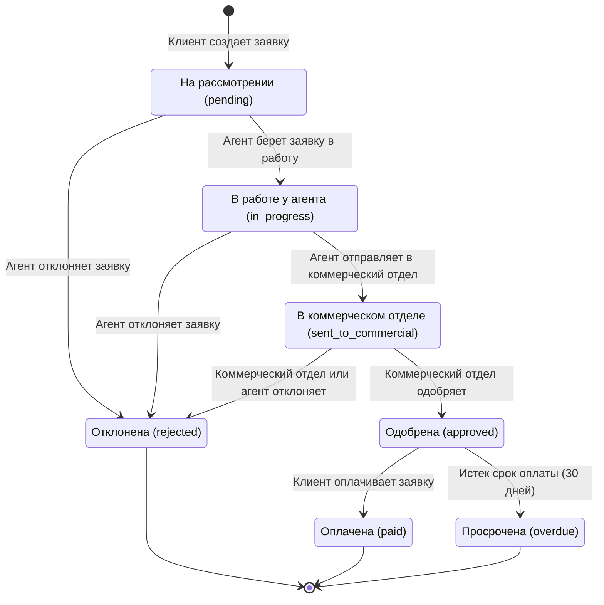
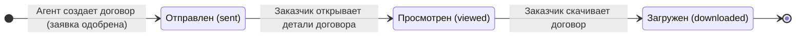
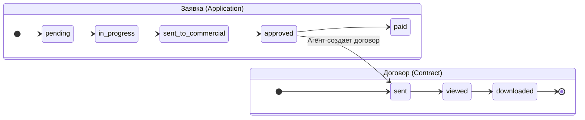

# Лабораторная работа №8 — Диаграмма состояний (UML State Machine Diagram)

## Цель работы
Освоение технологии проектирования ИС с помощью UML диаграмм.
Построение диаграммы состояний для объектов системы TVCompanyX.

---

## 1. Диаграмма состояний объекта «Заявка» (Application)

Заявка (Application) — центральный объект системы, проходящий через ряд состояний
от момента создания клиентом до финального исхода (оплата, отклонение или просрочка).

### Описание состояний

| # | Состояние | Русское название | Описание |
|---|-----------|------------------|----------|
| 1 | `pending` | На рассмотрении | Клиент создал заявку. Ожидает, пока агент возьмет в работу |
| 2 | `in_progress` | В работе у агента | Агент взял заявку, обсуждает детали с клиентом, может редактировать |
| 3 | `sent_to_commercial` | В коммерческом отделе | Агент передал заявку на рассмотрение коммерческому отделу |
| 4 | `approved` | Одобрена | Коммерческий отдел одобрил заявку. Можно создать договор |
| 5 | `rejected` | Отклонена | Заявка отклонена агентом или коммерческим отделом |
| 6 | `paid` | Оплачена | Клиент произвел оплату |
| 7 | `overdue` | Просрочена | Срок оплаты (30 дней после одобрения) истек без оплаты |

### Описание переходов (transitions)

| Переход | Событие (триггер) | Действующее лицо | Guard-условие |
|---------|-------------------|-------------------|---------------|
| `[*] → pending` | Создание заявки | Клиент (customer) | — |
| `pending → in_progress` | Взятие заявки в работу | Агент (agent) | agent_id назначается |
| `pending → rejected` | Отклонение заявки | Агент (agent) | — |
| `in_progress → sent_to_commercial` | Отправка в комм. отдел | Агент (agent) | Детали согласованы |
| `in_progress → rejected` | Отклонение заявки | Агент (agent) | — |
| `sent_to_commercial → approved` | Одобрение | Коммерческий отдел (commercial) | — |
| `sent_to_commercial → rejected` | Отклонение | Коммерческий отдел / Агент | — |
| `approved → paid` | Оплата | Клиент (customer) | payment_method указан |
| `approved → overdue` | Таймаут | Система (автоматически) | now() > due_date |
| `rejected → [*]` | Завершение жизненного цикла | — | Конечное состояние |
| `paid → [*]` | Завершение жизненного цикла | — | Конечное состояние |
| `overdue → [*]` | Завершение жизненного цикла | — | Конечное состояние |

### Дополнительные действия (отмена клиентом)

Клиент может отменить заявку в состояниях: `pending`, `in_progress`, `sent_to_commercial`.
При отмене заявка переходит в конечное состояние `[*]` (удаляется из системы).

---

## 2. Диаграмма состояний объекта «Договор» (Contract)

Договор создается агентом после одобрения заявки коммерческим отделом.
Проходит 3 состояния до полного завершения.

### Описание состояний

| # | Состояние | Русское название | Описание |
|---|-----------|------------------|----------|
| 1 | `sent` | Отправлен | Договор создан, присвоен номер DOG-2025-XXXXXX, отправлен клиенту |
| 2 | `viewed` | Просмотрен | Заказчик открыл детали договора в интерфейсе |
| 3 | `downloaded` | Загружен | Заказчик скачал файл договора |

---

## 3. Связь объектов

> **Связь:** Объект «Договор» создается только когда «Заявка» находится в состоянии `approved`.
> Это демонстрирует **межобъектное взаимодействие** на диаграмме состояний.

---

## Источники данных проекта

- `src/utils/statusHelpers.tsx` — определения статусов и их отображение
- `src/lib/database.ts` — бизнес-логика переходов между состояниями
- `docs/STATUS_CHANGES.md` — документация жизненного цикла заявки
- `docs/CONTRACTS_SYSTEM.md` — документация системы договоров
