# Лабораторная работа №9 — Проектирование пользовательского интерфейса

## Цель работы
Приобрести навыки проектирования графического интерфейса пользователя.

---

## 1. Карта навигации системы TVCompanyX

Система имеет **6 ролей пользователей**. После авторизации каждый пользователь
попадает на свою главную страницу с персональным набором разделов.

### Условия переходов
- Неавторизованный пользователь видит только **лендинг** и **страницу авторизации/регистрации**
- После входа в систему пользователь перенаправляется на главную страницу **своей роли**
- Доступ к разделам других ролей **заблокирован** (серверная проверка роли)
- Чат-разделы доступны только связанным ролям (заказчик ↔ агент, агент ↔ комм. отдел)

```mermaid
graph TD
    START["Главная страница<br/>(Лендинг)"] --> AUTH["Авторизация /<br/>Регистрация"]

    AUTH -->|role = customer| C_DASH["Главная заказчика"]
    AUTH -->|role = agent| A_DASH["Главная агента"]
    AUTH -->|role = commercial| CM_DASH["Главная комм. отдела"]
    AUTH -->|role = accountant| AC_DASH["Главная бухгалтера"]
    AUTH -->|role = admin| AD_DASH["Главная администратора"]
    AUTH -->|role = director| D_DASH["Главная директора"]

    subgraph CUSTOMER["Заказчик (customer)"]
        C_DASH --> C_CALC["Калькулятор стоимости"]
        C_DASH --> C_APP["Подать заявку"]
        C_DASH --> C_APPS["Мои заявки"]
        C_DASH --> C_DOCS["Документы"]
        C_DASH --> C_PROF["Профиль"]
        C_DASH --> C_CHAT["Чат с агентом"]
    end

    subgraph AGENT["Агент (agent)"]
        A_DASH --> A_APPS["Заявки клиентов"]
        A_DASH --> A_COMM["Комиссии"]
        A_DASH --> A_REP["Отчеты"]
        A_DASH --> A_CHAT["Чат с клиентами"]
    end

    subgraph COMMERCIAL["Коммерческий отдел (commercial)"]
        CM_DASH --> CM_SHOWS["Управление шоу"]
        CM_DASH --> CM_ADSCHED["Расписание рекламы"]
        CM_DASH --> CM_SCHED["Расписание шоу"]
        CM_DASH --> CM_APPS["Заявки от агентов"]
        CM_DASH --> CM_CHAT["Чат с агентами"]
    end

    subgraph ACCOUNTANT["Бухгалтер (accountant)"]
        AC_DASH --> AC_APPS["Одобренные заявки"]
        AC_DASH --> AC_REP["Отчеты"]
        AC_DASH --> AC_REV["Доходы"]
        AC_DASH --> AC_NOT["Уведомления"]
    end

    subgraph ADMIN["Администратор (admin)"]
        AD_DASH --> AD_USERS["Учетные записи"]
        AD_DASH --> AD_STATS["Статистика"]
        AD_DASH --> AD_LOGS["Логи сервера"]
        AD_DASH --> AD_SETT["Настройки системы"]
    end

    subgraph DIRECTOR["Директор (director)"]
        D_DASH --> D_STAFF["Статистика сотрудников"]
        D_DASH --> D_COMM["Комиссии агентов"]
        D_DASH --> D_CREP["Отчеты по клиентам"]
        D_DASH --> D_CSTAT["Статистика компании"]
    end

    style START fill:#eff6ff,stroke:#2563eb,color:#1e3a8a
    style AUTH fill:#dbeafe,stroke:#2563eb,color:#1e3a8a
    style CUSTOMER fill:#eff6ff,stroke:#3b82f6,color:#1e3a8a
    style AGENT fill:#f0fdf4,stroke:#22c55e,color:#166534
    style COMMERCIAL fill:#faf5ff,stroke:#a855f7,color:#581c87
    style ACCOUNTANT fill:#fefce8,stroke:#eab308,color:#854d0e
    style ADMIN fill:#fef2f2,stroke:#ef4444,color:#991b1b
    style DIRECTOR fill:#f0fdfa,stroke:#14b8a6,color:#134e4a
```



### Описание разделов по ролям

| Роль | Раздел | Назначение |
|------|--------|------------|
| **Заказчик** | Калькулятор стоимости | Расчет стоимости рекламного размещения |
| | Подать заявку | Форма создания новой заявки на размещение рекламы |
| | Мои заявки | Список всех заявок с текущими статусами |
| | Документы | Просмотр и скачивание договоров |
| | Профиль | Редактирование личных данных и банковских реквизитов |
| | Чат с агентом | Обсуждение деталей заявки с назначенным агентом |
| **Агент** | Заявки клиентов | Список заявок для обработки (взять в работу, отправить в комм. отдел) |
| | Комиссии | Просмотр начисленных комиссий по обработанным заявкам |
| | Отчеты | Генерация и скачивание отчетов |
| | Чат с клиентами | Переписка с заказчиками по заявкам |
| **Комм. отдел** | Управление шоу | CRUD-операции над телешоу (название, цена, расписание) |
| | Расписание рекламы | Управление рекламными слотами |
| | Расписание шоу | Календарь эфиров |
| | Заявки от агентов | Одобрение / отклонение заявок |
| | Чат с агентами | Коммуникация с агентами по заявкам |
| **Бухгалтер** | Одобренные заявки | Контроль оплаты одобренных заявок |
| | Отчеты | Финансовая отчетность |
| | Доходы | Сводка доходов компании |
| | Уведомления | Системные уведомления об оплатах и просрочках |
| **Администратор** | Учетные записи | Управление пользователями (создание, блокировка, роли) |
| | Статистика | Общая статистика системы |
| | Логи сервера | Просмотр серверных логов |
| | Настройки системы | Конфигурация параметров приложения |
| **Директор** | Статистика сотрудников | Показатели эффективности персонала |
| | Комиссии агентов | Сводка комиссионных выплат агентам |
| | Отчеты по клиентам | Аналитика по клиентской базе |
| | Статистика компании | Общие бизнес-показатели компании |

---

## 2. Цветовая палитра интерфейса

Интерфейс построен на двух основных цветовых шкалах (primary и secondary),
дополненных акцентными цветами для статусов.

### Основная палитра (5 цветов)

| Цвет | HEX | Применение |
|------|-----|------------|
| 🔵 **Primary Blue** | `#2563EB` | Основные кнопки, активные элементы, ссылки, заголовок бокового меню |
| ⚪ **Secondary Slate** | `#475569` | Текст, иконки, неактивные элементы, вторичные кнопки |
| ⬜ **Background Light** | `#F8FAFC` | Фон страницы (secondary-50) |
| ◻️ **Card White** | `#FFFFFF` | Фон карточек, модальных окон, боковой панели |
| 🔷 **Primary Light** | `#DBEAFE` | Фон активного пункта меню, подсветка, hover-состояния |

### Акцентные цвета (для статусов заявок)

| Цвет | HEX | Статус |
|------|-----|--------|
| 🟡 Желтый | `#FEF3C7` / `#92400E` | На рассмотрении (pending) |
| 🔵 Синий | `#DBEAFE` / `#1E40AF` | В работе (in_progress) |
| 🟣 Фиолетовый | `#F3E8FF` / `#6B21A8` | В коммерческом отделе (sent_to_commercial) |
| 🟢 Зеленый | `#D1FAE5` / `#065F46` | Одобрена (approved) |
| 🔴 Красный | `#FEE2E2` / `#991B1B` | Отклонена (rejected) |
| 💚 Изумрудный | `#D1FAE5` / `#065F46` | Оплачена (paid) |
| 🟠 Оранжевый | `#FFEDD5` / `#9A3412` | Просрочена (overdue) |

### Визуальная палитра

```
Primary Blue     ██████████  #2563EB
Primary Light    ██████████  #DBEAFE
Secondary Slate  ██████████  #475569
Background       ██████████  #F8FAFC
Card White       ██████████  #FFFFFF
```

---

## 3. Макеты графического интерфейса

> Макеты получены скриншотами реального работающего интерфейса системы.

*(Вставьте скриншоты ниже)*

### Макет 1 — Страница авторизации
<!--  -->

### Макет 2 — Панель заказчика (список заявок)
<!--  -->

### Макет 3 — Панель агента (чат с клиентом)
<!--  -->

---

## Источники

- `src/components/layout/Sidebar.tsx` — навигация по ролям
- `tailwind.config.js` — цветовая палитра
- `src/styles/globals.css` — глобальные стили компонентов
- `src/pages/auth.tsx` — логика маршрутизации после авторизации
