# Диаграмма активности: Работа агента и коммерции

```mermaid
%%{init: {'theme':'default', 'themeVariables': { 'fontSize':'14px'}}}%%

flowchart TB
    Start([Начало]) --> Login[👨‍💼 Рекламный агент:<br/>Войти в систему]
    
    Login --> OpenList[👨‍💼 Рекламный агент:<br/>Открыть список заявок]
    
    OpenList --> ReqApps[💻 Клиентская часть:<br/>Запросить заявки агента]
    
    ReqApps --> GetApps[🖥️ Серверная часть:<br/>SELECT WHERE agent_id]
    
    GetApps --> ReturnApps[🖥️ Серверная часть:<br/>Вернуть список]
    
    ReturnApps --> ShowTable[💻 Клиентская часть:<br/>Отобразить таблицу]
    
    ShowTable --> SelectApp[👨‍💼 Рекламный агент:<br/>Выбрать заявку<br/>status: in_progress]
    
    SelectApp --> ViewDetails[👨‍💼 Рекламный агент:<br/>Просмотреть детали:<br/>шоу, дата, стоимость]
    
    ViewDetails --> OpenChat[👨‍💼 Рекламный агент:<br/>Открыть чат с клиентом]
    
    OpenChat --> ConnectWS[💻 Клиентская часть:<br/>WebSocket подключение]
    
    ConnectWS --> EstablishConn[🖥️ Серверная часть:<br/>Socket.IO соединение]
    
    EstablishConn --> JoinRoom[🖥️ Серверная часть:<br/>Присоединить к комнате]
    
    JoinRoom --> WriteMsg[👨‍💼 Рекламный агент:<br/>Написать сообщение<br/>уточнить требования]
    
    WriteMsg --> SendMsg[💻 Клиентская часть:<br/>Отправить через WebSocket]
    
    SendMsg --> Fork1{Параллельно}
    
    Fork1 --> SaveMsg[🖥️ Серверная часть:<br/>Сохранить в chat_messages]
    Fork1 --> SendRealtime[🖥️ Серверная часть:<br/>Отправить клиенту]
    
    SaveMsg --> Join1{Синхронизация}
    SendRealtime --> Join1
    
    Join1 --> ReceiveReply[🖥️ Серверная часть:<br/>Получить ответ клиента]
    
    ReceiveReply --> ReadReply[👨‍💼 Рекламный агент:<br/>Прочитать ответ]
    
    ReadReply --> Coordinate[👨‍💼 Рекламный агент:<br/>Согласовать детали]
    
    Coordinate --> ReadyCheck{Клиент готов<br/>к размещению?}
    
    ReadyCheck -->|Нет| Continue[👨‍💼 Рекламный агент:<br/>Продолжить переписку]
    Continue --> RequestMore[👨‍💼 Рекламный агент:<br/>Запросить информацию]
    RequestMore --> End1([Ожидание<br/>ответа])
    
    ReadyCheck -->|Да| PrepMaterials[👨‍💼 Рекламный агент:<br/>Подготовить материалы]
    
    PrepMaterials --> AddComment[👨‍💼 Рекламный агент:<br/>Добавить комментарий]
    
    AddComment --> SendComment[💻 Клиентская часть:<br/>Отправить комментарий]
    
    SendComment --> SaveComment[🖥️ Серверная часть:<br/>Сохранить в БД]
    
    SaveComment --> ClickTransfer[👨‍💼 Рекламный агент:<br/>Нажать 'Передать в коммерцию']
    
    ClickTransfer --> SendStatus[💻 Клиентская часть:<br/>Запрос изменения статуса]
    
    SendStatus --> UpdateReady[🖥️ Серверная часть:<br/>Статус: ready_for_review]
    
    UpdateReady --> Fork2{Параллельно}
    
    Fork2 --> SaveStatus[🖥️ Серверная часть:<br/>Сохранить в БД]
    Fork2 --> CreateNotif[🖥️ Серверная часть:<br/>Уведомление для коммерции]
    
    SaveStatus --> Join2{Синхронизация}
    CreateNotif --> Join2
    
    Join2 --> SendNotif[🖥️ Серверная часть:<br/>Отправить WebSocket]
    
    SendNotif --> CommNotif[🏢 Коммерческий отдел:<br/>Получить уведомление]
    
    CommNotif --> CommOpenList[🏢 Коммерческий отдел:<br/>Открыть список на проверку]
    
    CommOpenList --> ReqReview[💻 Клиентская часть:<br/>Запросить ready_for_review]
    
    ReqReview --> GetReview[🖥️ Серверная часть:<br/>SELECT WHERE status]
    
    GetReview --> ReturnReview[🖥️ Серверная часть:<br/>Вернуть список]
    
    ReturnReview --> ShowReview[💻 Клиентская часть:<br/>Отобразить таблицу]
    
    ShowReview --> CommSelect[🏢 Коммерческий отдел:<br/>Выбрать заявку]
    
    CommSelect --> CommView[🏢 Коммерческий отдел:<br/>Просмотреть детали,<br/>комментарии, чат]
    
    CommView --> CheckTime[🏢 Коммерческий отдел:<br/>Проверить доступность<br/>времени эфира]
    
    CheckTime --> ReqSchedule[💻 Клиентская часть:<br/>Запросить расписание]
    
    ReqSchedule --> CheckConflict[🖥️ Серверная часть:<br/>Проверить конфликты<br/>в shows]
    
    CheckConflict --> ReturnCheck[🖥️ Серверная часть:<br/>Вернуть результат]
    
    ReturnCheck --> StudyResult[🏢 Коммерческий отдел:<br/>Изучить результат]
    
    StudyResult --> CheckReq[🏢 Коммерческий отдел:<br/>Проверить соответствие<br/>требованиям]
    
    CheckReq --> Decision{Всё в порядке?}
    
    Decision -->|Нет| ClickReject[🏢 Коммерческий отдел:<br/>Нажать 'Отклонить']
    
    ClickReject --> EnterReason[🏢 Коммерческий отдел:<br/>Указать причину:<br/>конфликт/несоответствие]
    
    EnterReason --> SendReject[💻 Клиентская часть:<br/>Запрос на отклонение]
    
    SendReject --> UpdateReject[🖥️ Серверная часть:<br/>Статус: rejected]
    
    UpdateReject --> SaveReason[🖥️ Серверная часть:<br/>Сохранить причину]
    
    SaveReason --> Fork3{Параллельно}
    
    Fork3 --> SaveReject[🖥️ Серверная часть:<br/>Сохранить в БД]
    Fork3 --> NotifyAgent[🖥️ Серверная часть:<br/>Уведомить агента]
    Fork3 --> NotifyCustomer[🖥️ Серверная часть:<br/>Уведомить клиента]
    
    SaveReject --> Join3{Синхронизация}
    NotifyAgent --> Join3
    NotifyCustomer --> Join3
    
    Join3 --> SendRejectNotif[🖥️ Серверная часть:<br/>Отправить WebSocket]
    
    SendRejectNotif --> AgentGetReject[👨‍💼 Рекламный агент:<br/>Получить уведомление]
    
    AgentGetReject --> ReadReason[👨‍💼 Рекламный агент:<br/>Прочитать причину]
    
    ReadReason --> OpenChatAgain[👨‍💼 Рекламный агент:<br/>Открыть чат]
    
    OpenChatAgain --> InformCustomer[👨‍💼 Рекламный агент:<br/>Сообщить о проблемах]
    
    InformCustomer --> CanFix{Можно<br/>исправить?}
    
    CanFix -->|Нет| CloseApp[👨‍💼 Рекламный агент:<br/>Закрыть заявку]
    CloseApp --> SendClose[💻 Клиентская часть:<br/>Запрос на закрытие]
    SendClose --> UpdateCancel[🖥️ Серверная часть:<br/>Статус: cancelled]
    UpdateCancel --> End2([Заявка<br/>отклонена])
    
    CanFix -->|Да| NewTerms[👨‍💼 Рекламный агент:<br/>Согласовать новые условия]
    NewTerms --> UpdateApp[👨‍💼 Рекламный агент:<br/>Обновить данные заявки]
    UpdateApp --> SendUpdate[💻 Клиентская часть:<br/>Отправить обновление]
    SendUpdate --> SaveUpdate[🖥️ Серверная часть:<br/>Обновить в БД]
    SaveUpdate --> ReturnStatus[🖥️ Серверная часть:<br/>Вернуть в in_progress]
    ReturnStatus --> RetryTransfer[👨‍💼 Рекламный агент:<br/>Повторно передать]
    RetryTransfer --> End3([Повторная<br/>проверка])
    
    Decision -->|Да| ClickApprove[🏢 Коммерческий отдел:<br/>Нажать 'Одобрить']
    
    ClickApprove --> SendApprove[💻 Клиентская часть:<br/>Запрос на одобрение]
    
    SendApprove --> UpdateApprove[🖥️ Серверная часть:<br/>Статус: approved]
    
    UpdateApprove --> SetDate[🖥️ Серверная часть:<br/>approved_at = NOW]
    
    SetDate --> Fork4{Параллельно}
    
    Fork4 --> CalcComm[🖥️ Серверная часть:<br/>Рассчитать комиссию<br/>5% от стоимости]
    Fork4 --> CreateCommRec[🖥️ Серверная часть:<br/>Создать запись<br/>в commissions]
    Fork4 --> NotifyAgent2[🖥️ Серверная часть:<br/>Уведомить агента]
    Fork4 --> NotifyCustomer2[🖥️ Серверная часть:<br/>Уведомить клиента]
    
    CalcComm --> Join4{Синхронизация}
    CreateCommRec --> Join4
    NotifyAgent2 --> Join4
    NotifyCustomer2 --> Join4
    
    Join4 --> SendApproveNotif[🖥️ Серверная часть:<br/>Отправить WebSocket]
    
    SendApproveNotif --> AgentGetApprove[👨‍💼 Рекламный агент:<br/>Получить уведомление<br/>'Одобрена, комиссия: ₽XXX']
    
    AgentGetApprove --> SeeStatus[👨‍💼 Рекламный агент:<br/>Увидеть обновлённый статус]
    
    SeeStatus --> NextContract[👨‍💼 Рекламный агент:<br/>Перейти к созданию договора]
    
    NextContract --> Success([Заявка<br/>одобрена])
    
    style Start fill:#90EE90
    style End1 fill:#FFFFE0
    style End2 fill:#F08080
    style End3 fill:#FFFFE0
    style Success fill:#90EE90
    
    style GetApps fill:#E6F3FF
    style ReturnApps fill:#E6F3FF
    style EstablishConn fill:#E6F3FF
    style JoinRoom fill:#E6F3FF
    style SaveMsg fill:#E6F3FF
    style SendRealtime fill:#E6F3FF
    style ReceiveReply fill:#E6F3FF
    style SaveComment fill:#E6F3FF
    style UpdateReady fill:#E6F3FF
    style SaveStatus fill:#E6F3FF
    style CreateNotif fill:#E6F3FF
    style SendNotif fill:#E6F3FF
    style GetReview fill:#E6F3FF
    style ReturnReview fill:#E6F3FF
    style CheckConflict fill:#E6F3FF
    style ReturnCheck fill:#E6F3FF
    style UpdateReject fill:#E6F3FF
    style SaveReason fill:#E6F3FF
    style SaveReject fill:#E6F3FF
    style NotifyAgent fill:#E6F3FF
    style NotifyCustomer fill:#E6F3FF
    style SendRejectNotif fill:#E6F3FF
    style SaveUpdate fill:#E6F3FF
    style ReturnStatus fill:#E6F3FF
    style UpdateApprove fill:#E6F3FF
    style SetDate fill:#E6F3FF
    style CalcComm fill:#E6F3FF
    style CreateCommRec fill:#E6F3FF
    style NotifyAgent2 fill:#E6F3FF
    style NotifyCustomer2 fill:#E6F3FF
    style SendApproveNotif fill:#E6F3FF
    style UpdateCancel fill:#E6F3FF
    
    style ReqApps fill:#FFE6F0
    style ShowTable fill:#FFE6F0
    style ConnectWS fill:#FFE6F0
    style SendMsg fill:#FFE6F0
    style SendComment fill:#FFE6F0
    style SendStatus fill:#FFE6F0
    style ReqReview fill:#FFE6F0
    style ShowReview fill:#FFE6F0
    style ReqSchedule fill:#FFE6F0
    style SendReject fill:#FFE6F0
    style SendClose fill:#FFE6F0
    style SendUpdate fill:#FFE6F0
    style SendApprove fill:#FFE6F0
```

## 📋 Описание дорожек

### 👨‍💼 Дорожка: Рекламный агент
- Просмотр назначенных заявок
- Общение с клиентом через чат
- Согласование деталей размещения
- Подготовка материалов для коммерции
- Передача заявки на проверку
- Обработка отклонённых заявок
- Получение уведомлений об одобрении

### 🏢 Дорожка: Коммерческий отдел
- Получение заявок на проверку
- Просмотр деталей и истории
- Проверка доступности времени эфира
- Проверка соответствия требованиям
- Одобрение или отклонение заявки
- Указание причин отклонения

### 💻 Дорожка: Клиентская часть
- Отправка запросов к серверу
- Отображение данных в интерфейсе
- WebSocket подключение для чата
- Обработка форм и действий пользователя

### 🖥️ Дорожка: Серверная часть
- Обработка запросов к БД
- Управление WebSocket соединениями
- Сохранение сообщений чата
- Обновление статусов заявок
- Проверка конфликтов в расписании
- Расчёт комиссии агента (5%)
- Отправка уведомлений в реальном времени

## 🔄 Ключевые процессы

1. **Работа с чатом**: Real-time общение через Socket.IO
2. **Передача заявки**: Смена статуса с `in_progress` на `ready_for_review`
3. **Проверка коммерцией**: Анализ расписания и требований
4. **Обработка одобрения**: Автоматический расчёт комиссии 5%
5. **Обработка отклонения**: Возможность исправить и отправить повторно
6. **Уведомления**: Все изменения статуса транслируются через WebSocket

## 💡 Параллельные операции

- Сохранение и отправка сообщений чата
- Обновление статуса и создание уведомлений
- Расчёт комиссии и отправка уведомлений всем участникам
