# Диаграмма активности: Процесс создания договора и регистрации оплаты

```mermaid
%%{init: {'theme':'default', 'themeVariables': { 'fontSize':'16px'}}}%%

flowchart TB
    Start([Начало]) --> Login[Рекламный агент:<br/>Войти в систему]
    
    Login --> OpenApp[Рекламный агент:<br/>Открыть одобренную заявку]
    
    OpenApp --> Check{Все детали<br/>согласованы?}
    
    Check -->|Нет| Negotiate[Рекламный агент:<br/>Продолжить переговоры]
    Negotiate --> End1([Требуется<br/>согласование])
    
    Check -->|Да| CreateBtn[Рекламный агент:<br/>Нажать 'Создать договор']
    
    CreateBtn --> SendReq[Клиентская часть:<br/>Отправить запрос<br/>на создание]
    
    SendReq --> ReceiveReq[Серверная часть:<br/>Получить запрос]
    
    ReceiveReq --> GenNum[Серверная часть:<br/>Генерация номера<br/>DOG-2025-XXXXXX]
    
    GenNum --> CollectData[Серверная часть:<br/>Собрать данные договора]
    
    CollectData --> Fork1{Параллельно}
    
    Fork1 --> SaveContract[Серверная часть:<br/>Сохранить в БД]
    Fork1 --> SetStatus[Серверная часть:<br/>Статус: 'sent']
    Fork1 --> NotifyCustomer[Серверная часть:<br/>Уведомить клиента]
    
    SaveContract --> Join1{Синхронизация}
    SetStatus --> Join1
    NotifyCustomer --> Join1
    
    Join1 --> SendWS[Серверная часть:<br/>WebSocket уведомление]
    
    SendWS --> AgentNotif[Рекламный агент:<br/>Увидеть уведомление]
    
    AgentNotif --> CustomerNotif[Заказчик:<br/>Получить уведомление]
    
    CustomerNotif --> OpenDocs[Заказчик:<br/>Войти в раздел 'Документы']
    
    OpenDocs --> ReqList[Клиентская часть:<br/>Запросить список]
    
    ReqList --> GetList[Серверная часть:<br/>Выбрать договоры из БД]
    
    GetList --> ReturnList[Серверная часть:<br/>Вернуть список]
    
    ReturnList --> ShowTable[Клиентская часть:<br/>Отобразить таблицу]
    
    ShowTable --> FindContract[Заказчик:<br/>Найти договор]
    
    FindContract --> ClickView[Заказчик:<br/>Нажать 'Просмотреть']
    
    ClickView --> UpdateViewed[Серверная часть:<br/>Статус: 'viewed']
    
    UpdateViewed --> ShowDetails[Клиентская часть:<br/>Показать детали]
    
    ShowDetails --> Study[Заказчик:<br/>Изучить условия]
    
    Study --> AgreeDecision{Согласен?}
    
    AgreeDecision -->|Нет| ContactAgent[Заказчик:<br/>Связаться с агентом]
    ContactAgent --> End2([Требуются<br/>уточнения])
    
    AgreeDecision -->|Да| Download[Заказчик:<br/>Нажать 'Скачать']
    
    Download --> DownloadReq[Клиентская часть:<br/>Запрос на скачивание]
    
    DownloadReq --> UpdateDownloaded[Серверная часть:<br/>Статус: 'downloaded']
    
    UpdateDownloaded --> GenPDF[Серверная часть:<br/>Сгенерировать PDF]
    
    GenPDF --> ReturnPDF[Серверная часть:<br/>Вернуть файл]
    
    ReturnPDF --> DownloadFile[Клиентская часть:<br/>Скачать на устройство]
    
    DownloadFile --> GetFile[Заказчик:<br/>Получить файл]
    
    GetFile --> PayExternal[Заказчик:<br/>Произвести оплату<br/>вне системы]
    
    PayExternal --> AccountantInfo[Бухгалтер:<br/>Получить информацию<br/>об оплате]
    
    AccountantInfo --> AccountantLogin[Бухгалтер:<br/>Войти в систему]
    
    AccountantLogin --> OpenPayments[Бухгалтер:<br/>Открыть раздел 'Платежи']
    
    OpenPayments --> FindApp[Бухгалтер:<br/>Найти заявку]
    
    FindApp --> ClickRegister[Бухгалтер:<br/>Нажать 'Зарегистрировать<br/>платёж']
    
    ClickRegister --> FillForm[Бухгалтер:<br/>Заполнить форму<br/>сумма, способ, дата]
    
    FillForm --> SendPayment[Клиентская часть:<br/>Отправить данные<br/>на сервер]
    
    SendPayment --> ReceivePayment[Серверная часть:<br/>Получить данные]
    
    ReceivePayment --> CheckAmount{Сумма<br/>совпадает?}
    
    CheckAmount -->|Нет| ReturnError[Серверная часть:<br/>Вернуть ошибку]
    ReturnError --> ShowError[Бухгалтер:<br/>Увидеть ошибку]
    ShowError --> End3([Ошибка регистрации])
    
    CheckAmount -->|Да| Fork2{Параллельно}
    
    Fork2 --> UpdatePaid[Серверная часть:<br/>Статус заявки: 'paid']
    Fork2 --> SavePayment[Серверная часть:<br/>Сохранить платёж]
    Fork2 --> SetDate[Серверная часть:<br/>payment_date = NOW]
    Fork2 --> CalcCommission[Серверная часть:<br/>Рассчитать комиссию]
    Fork2 --> UpdateCommission[Серверная часть:<br/>Обновить commissions]
    
    UpdatePaid --> Join2{Синхронизация}
    SavePayment --> Join2
    SetDate --> Join2
    CalcCommission --> Join2
    UpdateCommission --> Join2
    
    Join2 --> Fork3{Параллельно}
    
    Fork3 --> NotifyCustomer2[Серверная часть:<br/>Уведомить заказчика]
    Fork3 --> NotifyAgent[Серверная часть:<br/>Уведомить агента]
    Fork3 --> NotifyCommercial[Серверная часть:<br/>Уведомить коммерцию]
    
    NotifyCustomer2 --> Join3{Синхронизация}
    NotifyAgent --> Join3
    NotifyCommercial --> Join3
    
    Join3 --> SendNotifs[Серверная часть:<br/>Отправить через WebSocket]
    
    SendNotifs --> AccountantConf[Бухгалтер:<br/>Подтверждение]
    
    AccountantConf --> CustomerConf[Заказчик:<br/>Уведомление получено]
    
    CustomerConf --> AgentConf[Рекламный агент:<br/>Комиссия рассчитана]
    
    AgentConf --> CommercialConf[Коммерческий отдел:<br/>Заявка оплачена]
    
    CommercialConf --> Success([Процесс успешно<br/>завершён])
    
    style Start fill:#90EE90
    style End1 fill:#FFFFE0
    style End2 fill:#FFFFE0
    style End3 fill:#F08080
    style Success fill:#90EE90
    
    style SaveContract fill:#E6F3FF
    style SetStatus fill:#E6F3FF
    style NotifyCustomer fill:#E6F3FF
    style GetList fill:#E6F3FF
    style UpdateViewed fill:#E6F3FF
    style UpdateDownloaded fill:#E6F3FF
    style GenPDF fill:#E6F3FF
    style ReceivePayment fill:#E6F3FF
    style UpdatePaid fill:#E6F3FF
    style SavePayment fill:#E6F3FF
    style SetDate fill:#E6F3FF
    style CalcCommission fill:#E6F3FF
    style UpdateCommission fill:#E6F3FF
    style SendNotifs fill:#E6F3FF
    
    style SendReq fill:#FFE6F0
    style ReqList fill:#FFE6F0
    style ShowTable fill:#FFE6F0
    style ShowDetails fill:#FFE6F0
    style DownloadReq fill:#FFE6F0
    style DownloadFile fill:#FFE6F0
    style SendPayment fill:#FFE6F0
```

## Описание дорожек

### 👤 Дорожка: Заказчик
- Получение уведомления о договоре
- Просмотр и изучение условий договора
- Скачивание документа
- Оплата (вне системы)

### 👨‍💼 Дорожка: Рекламный агент
- Инициация создания договора
- Получение уведомлений о статусе
- Получение информации о рассчитанной комиссии

### 💰 Дорожка: Бухгалтер
- Получение информации об оплате
- Регистрация платежа в системе
- Заполнение данных о платеже

### 🏢 Дорожка: Коммерческий отдел
- Получение уведомления об оплате

### 💻 Дорожка: Клиентская часть
- Отправка запросов на сервер
- Отображение данных пользователю
- Скачивание файлов

### 🖥️ Дорожка: Серверная часть
- Генерация номера договора
- Сохранение данных в БД
- Расчёт комиссии агента
- Обработка платежей
- Отправка уведомлений через WebSocket

## Ключевые моменты процесса

1. **Создание договора**: Автоматическая генерация уникального номера и сохранение в БД
2. **Уведомления**: Все участники получают уведомления в реальном времени через WebSocket
3. **Статусы договора**: sent → viewed → downloaded
4. **Параллельная обработка**: Сохранение данных и отправка уведомлений происходят одновременно
5. **Валидация платежа**: Проверка соответствия суммы перед регистрацией
6. **Комиссия агента**: Автоматический расчёт после подтверждения оплаты
<!-- [MermaidChart: e188cac3-91f9-4bf4-8b2a-ee7cd819cd2a] -->
<!-- [MermaidChart: e188cac3-91f9-4bf4-8b2a-ee7cd819cd2a] -->
